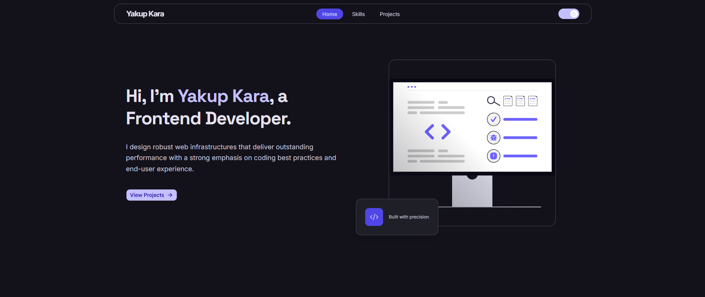
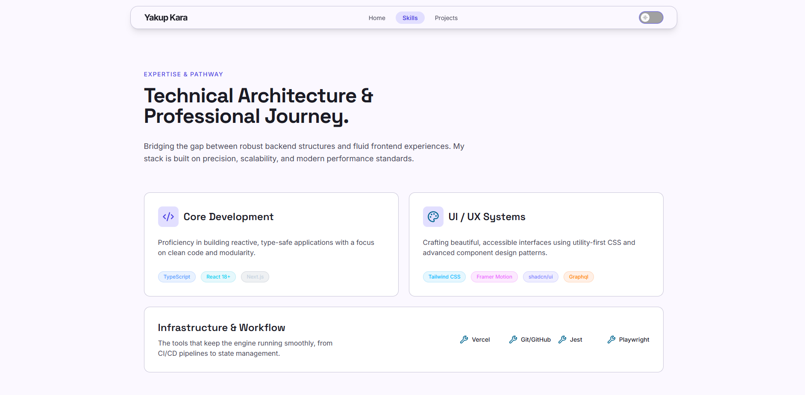

# yakupkara.com — Personal Portfolio

A modern, performant personal portfolio built with Next.js 15 and TypeScript. Showcasing projects, skills, and professional experience.

## Live Demo
[yakupkara.com](https://www.yakupkara.com)

## Tech Stack

- **Framework:** Next.js 15 (App Router)
- **Language:** TypeScript
- **Styling:** Tailwind CSS
- **UI Components:** shadcn/ui
- **Animations:** Framer Motion
- **Testing:** Jest + React Testing Library, Playwright
- **Deployment:** Vercel

## Project Structure
app/              # Pages and routing
components/
layout/         # Header, Footer, ThemeToggle
sections/       # Page sections (Hero, Philosophy, Skills, etc.)
ui/             # shadcn/ui components
lib/              # Utility functions
hooks/            # Custom hooks
types/            # TypeScript types

## Getting Started

```bash
# Clone the repository
git clone git@github-personal:yakupkaraa/personal-portfolio.git

# Install dependencies
npm install

# Run development server
npm run dev
```

## Testing

```bash
# Unit tests
npm test

# E2E tests
npm run test:e2e
```

## License
MIT

##  Screenshots




